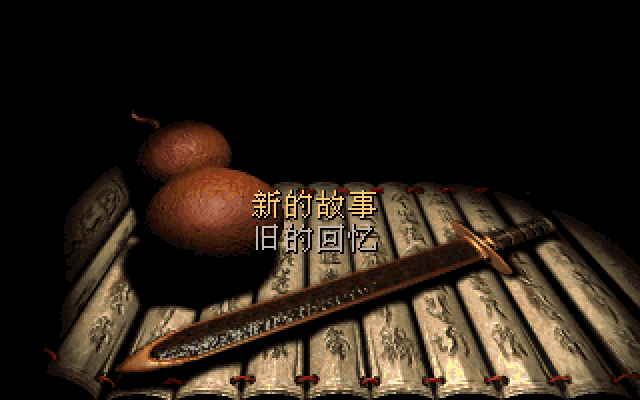
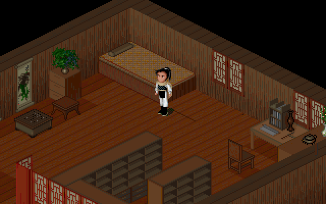
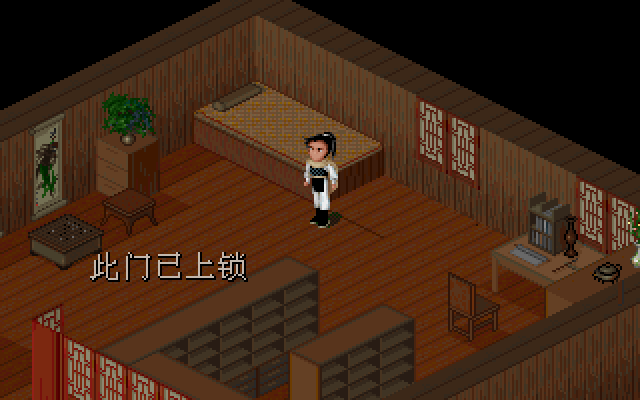
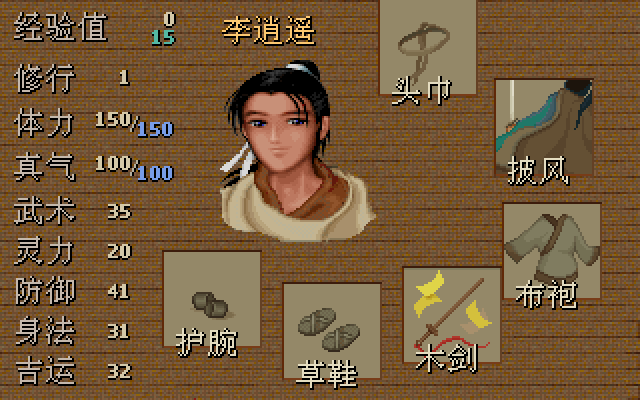
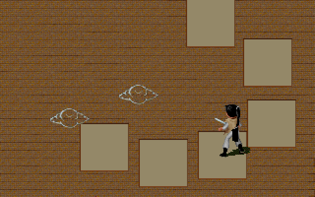

# 《仙剑奇侠传 DOS 版》— Rust 移植

#### 简介

1995年7月10日出品（故常被称作“仙剑95版”），由大宇资讯狂徒创作群制作，是影响了整整一代玩家的游戏大作。感人的剧情、动情的音乐、还有那优雅的诗词至今仍让老一辈的玩家难以忘怀。游戏的主角李逍遥、赵灵儿、林月如、阿奴，也成了游戏界的明星人物。

本仓库是该 DOS 版游戏引擎的 **完整 Rust 移植**（自 [SDLPAL](https://github.com/sdlpal/sdlpal) 的 C 源码移植，`PAL_CLASSIC` 经典模式），直接运行 `pal/` 目录中的原版游戏数据，不再需要 DOSBox。

This is a **complete Rust reimplementation** of the PAL (Legend of Sword
and Fairy, DOS version) game engine, ported from SDLPAL and running the
original game data shipped in `pal/` — no DOSBox required.

#### 运行 / Running

```shell
cargo run --release
```

操作：方向键移动，空格/回车 调查·确认，Esc 菜单；战斗中 R 连续攻击、A 自动、D 防御、E 物品、W 投掷、Q 逃跑、F 仙术、S 状态。

#### 支持平台

macOS / Linux / Windows（winit + pixels 渲染，cpal 音频）。

#### 架构 / Architecture

- `src/game_loop.rs` — `Engine` 核心：全部游戏状态、winit/pixels 视频、帧循环、调色板渐变与转场
- 各子系统以 `impl Engine` 扩展：`scene`（地图与精灵渲染、移动碰撞）、`script`（完整脚本解释器）、`play`、`ui`/`uigame`/`itemmenu`/`magicmenu`（对话与菜单）、`battle`/`fight`/`uibattle`（经典回合制战斗）、`ending`、`rngplay`（过场动画）
- 数据层：`mkf`（MKF 档案）、`yj`（YJ_1/YJ_2 解压）、`map`、`global`（游戏数据与 DOS 存档格式）、`text`/`font`（Big5 文本 + 原版 WOR16 字库）
- 音频：`opl`（DOSBox DBOPL 移植）、`rix`（RIX 音乐）、`voc`（音效）、`audio`（混音）

#### 移植保真度 / Fidelity

- YJ_1 解压与 C 实现在全部 1159 个压缩块上逐字节一致
- OPL/RIX 音乐渲染与 C++ 原实现在 20 首曲目 × 30 秒上逐字节一致
- 画面经无头渲染逐帧验证（`examples/` 内含验证工具）
- 94 个单元测试 + 4 个端到端集成测试（`cargo test`，需要 `pal/` 数据）

#### 截图 / Screenshots







